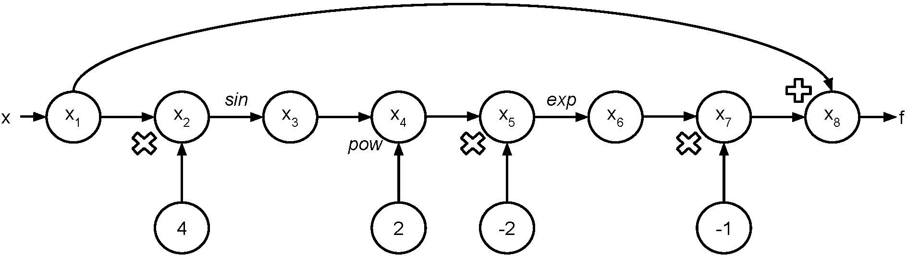

# Documentation

## Table of Contents
- [Introduction](#introduction)
- [Background](#background)
- [How to Use adlib27](#howtouse)
  - [Examples](#examples)
- [Software Organization](#software_org)
  - [Directory Structure](#structure)
  - [Included Modules](#modules)
  - [Tests](#tests)
  - [Package and Framework](#package)
  - [Distribution](#dist)
- [Implementation](#implementation)
  - [Data Structures](#data_structures)
  - [autodiff](#autodiff)
  - [elem_function](#elem_function)
  - [interact](#interact)
  - [optimize](#optimize)
  - [External Dependencies](#dependencies)
- [Additional Features](#future_features)


## Introduction <a name="introduction"></a>

Automatic differentiation is a method to evaluate derivatives of any linear or nonlinear systems that differs from other traditional methods such as symbolic differentiation or numeric differentiation. Numeric differentiation can be simple to implement but it can also introduce rounding and truncation errors and thus make the results inaccurate. Symbolic differentiation can be time consuming and also result in complex and cryptic expressions. Furthermore, symbolic methods require the model to be close-form which are not applicable in many machine learning problems.

Automatic differentiation addresses the above issues by using chain rules and computing derivatives up to machine precision. It has been well established in many fields including atmospheric sciences, fluid dynamics, optimization, and has been rapidly growing in machine learning.


## Background <a name="background"></a>

As explained in the introduction, automatic differentiation evades both the approximation problems of numeric differentiation and the complexity problems of symbolic differentiation. Essentially, automatic differentiation continuously applies the chain rule to a function at a certain point. Automatic differentiation is able to do this by exploiting the fact that all functions input by a user to a computer can be represented as some combination of elementary functions. These elementary functions include arithmetic functions, trigonometric functions, exponential functions, logarithmic functions, and nth root functions. The function is expanded in terms of these elementary functions, and the chain rule is applied by writing an array of derivatives, each in terms of the last, until a final derivative is found. The implementation of this method is further explained below.

For forward automatic differentiation, first, the function is rewritten as a map of elementary functions applied to the input, with each step in the map being represented by a distinct trace. For example, if the function is “5*x + 1”, some input trace x1 becomes trace x2 by being multiplied by 5, which becomes trace x3 by adding 1, and then x3 is the output. Every elementary function applied to the input is represented by such a change in the trace. This mapping is represented as a flowchart between traces, with elementary functions represented by arrows between traces.

This map is used to generate the elementary function, elementary function value, elementary function derivative, and derivative value for each trace. In the case of multi-value inputs to the function (for example, “5*x +3*y +1”), the partial derivative is taken with respect to each input. For each trace, the elementary function and elementary function derivative are written in terms of the previously-evaluated, constituent traces, and evaluated at the values and derivative values of these constituent traces. In this way, the traces are recursively determined through a continuous application of the chain rule. The evaluated derivative of the final trace becomes the output, and forward automatic differentiation is complete.

One can see, then, that what the forward mode is doing is efficiently computing the Jacobian-vector product given a "seed" vector.

For example, if we wanted to compute `f(pi/16)` for `f(x) = x - exp(-2sin(4*x)**2)`, we could use the forward mode to generate the following evaluation trace:

trace | value | derivative
--- | --- | ---
`x1` | `pi/16` | `pi/16`
`x2` | `4*x1` | `pi/4`
`x3` | `sin(x2)` | `sqrt(2)/2`
`x4` | `x3 ** 2` | `1/2`
`x5` | `-2x4` | `-1`
`x6` | `exp(x5)` | `1/e`
`x7` | `-x6` | `-1/e`
`x8` | `x1 + x7` | `pi/16 - 1/e`

And the corresponding evaluation graph would look like the below, where we indicate the input value as `x` and the output value as `f`:



## How to Use adlib27 <a name="howtouse"></a>

The end user will install our package in their own terminal using the pip install command.

```
pip install adlib27
```

After installing our package, the user can use adlib27 in their own program(s) as demonstrated in the following examples.

Should the user elect to clone the GitHub repository directly into their own workspace, the user can also use adlib27 in the same way as if they’d installed it via pip, as long as they install the dependencies included in `requirements.txt`.  Alternatively, if the user has cloned our repo, the user can run our interact.py file where, via the terminal interface, the user can interact with an application that we’ve written, which uses our library. This application can be used in two ways. For the first way, the user will be prompted to provide a function as input. The function can be a scalar constant, a trigonometric function such as sine, cosine, etc., an exponential, and even vector-valued (more details on supported functions in the implementation section). When inputting functions to interact.py, functions must be written with Python notation for arithmetic and power operations, and using sin(), cos(), tan(), and exp() to signify sine, cosine, tangent, and exponential functions respectively. The following inputs will be the value(s) at which to evaluate the function and its derivative. The second way to use interact.py is for performing optimization, which we’ll discuss further in the “Additional Feature(s)” portion of this document.

As mentioned earlier, however, if the user is a developer who would want to use our package in his/her code, he/she can use it in their own code as follows:

```
import adlib27
```

Or, if they want specific functionality:

```
import adlib27.elem_function as ef
from adlib27.autodiff import AutoDiff as AD
from adlib27.optimize import optimize
```

For a single variable case, the user would be able to create an AutoDiff object by calling the constructor with a specific value as the argument. The value provided is the value at which the function and its derivative will be evaluated. The value will be provided in a list format (even in a single variable case). After constructing an AutoDiff object, the user can then use that AutoDiff object as a variable to construct their desired function (note that the resulting function will itself be an AutoDiff object). 

The value of the resulting function will be stored as a property of the resulting AutoDiff object in list format, and the derivative will be returned in a list of lists (for a single variable and for multiple variable case). 

### Examples <a name="examples"></a>

Simple scalar function
```
x = AD([3])
my_func = x**2 + 1
my_func.val → will produce the output: [10]
my_func.der → will produce the output: [[6]]
```

Vector function
```
x = AD([1,2])
my_func = x**2 + 1
my_func.val → will produce the output: [2, 5]
my_func.der → will produce the output: [[2, 4]]
```

Trigonometric scalar function (e.g., `sin x`, `cos x`, `tan x`)
```
x = AD([0])
my_func = ef.sin(x)
my_func.val → will produce the output: [0]
my_func.der → will produce the output: [[1]]
```

Resetting the value to evaluate the function at is also supported. Note that in this case the derivative would then need to be updated by the user as well, so we don’t recommend manually overriding the value of an AutoDiff object for this reason. (Demonstrated below).
```
x = AD([0])
x.val → will produce the output: [0]
x.val = [1]
x.val → will produce the output: [1]
```

For the multivariable case (one function case), the user would need to create each variable separately as an AutoDiff object. The inputs to each of the AutoDiff objects will be: the value/s in a list format (same as before), the `index` of the variable (indicated by the `index` field, it represents whether this variable is the first variable, the second, etc, which helps us keep track of the partial derivatives of the final function they’ll be used in), and how many total variables there are going to be in the final function (i.e., the magnitude). Thus, the AutoDiff object is able to store the derivatives of multiple variables at multiple values at once.

Multivariable case with one value:
```
x = AD([10], index=0, magnitude=2)
y = AD([5], index=1, magnitude=2)
z = 2*x + y
z.val → will produce the output: [25]
z.der → will produce the output: [[2], [1]]
```

Multivariable case with multiple values:

```
x = AD([10, -1, 3.2, 4], index=0, magnitude=2)
y = AD([-2, 0, 1, 100], index=1, magnitude=2)
z = x + y
z.val → will produce the output: [8, -1, 4.2, 104]
z.der → will produce the output: [[1, 1, 1, 1], [1, 1, 1, 1]]
```

Multivariable case with multiple functions:

```
x = AD([10, -1, 3.2, 4], index=0, magnitude=2)
y = AD([-2, 0, 1, 100], index=1, magnitude=2)

w = AD([1, -1, 6, 5], index=0, magnitude=2)
q = AD([8, 0, 1, 2], index=1, magnitude=2)

z = x + y
t = w +2*q 

z.val → will produce the output: [8, -1, 4.2, 104]
z.der → will produce the output: [[1, 1, 1, 1], [1, 1, 1, 1]] 

t.val → will produce the output: [17, -1, 8, 9]
t.der → will produce the output: [[1, 1, 1, 1], [2, 2, 2, 2]]
```

## Software Organization <a name="software_org"></a>

### Directory Structure <a name="structure"></a>

```
cs207-FinalProject/
    adlib27/
        autodiff.py
        interact.py
        elem_function.py
        optimize.py
    tests/
         test_autodiff.py
         test_elem_function.py
         test_interact.py
         test_optimize.py
    docs/
        documentation.md
        milestone1.md
        milestone2.md
    adlib27.egg-info/
        PKG-INFO
        SOURCES.txt
        dependency_links.txt
        requires.txt
        top_level.txt
    dist/
        adlib27-1.0.0.tar.gz
    README.md
    LICENSE.txt
    .travis.yml
    setup.py
    setup.cfg
    requirements.txt  
```

### Included Modules <a name="modules"></a>

  - `autodiff.py`

    This module contains our automatic differentiation class, AutoDiff, which is meant to be imported by developers and used to instantiate AutoDiff objects. The class overloads Python’s arithmetic operators in order to support the construction of more complex AutoDiff objects.

  - `interact.py`

    This module allows the user to interact with our automatic differentiation library via a command line interface. The user is prompted for a function f to evaluate, then for the value(s) at which to evaluate f. The module then either prints the final value and derivative of the given function at the given x-value, or performs optimization for f, depending on what the user wants.

  - `elem_function.py`

    This module is used in conjunction with autodiff.py to support the elementary functions in the construction of more complex AutoDiff objects. Each of these elementary functions takes in an AutoDiff object as input and returns a new AutoDiff object with the appropriate value and derivative (by passing in the input’s value and derivative to the corresponding numpy function). If, instead of an AutoDiff object, a float value is passed in, the elementary function will simply pass in the float value to the corresponding numpy function and return that new value instead.

  - `optimize.py`
    This module is used in conjunction with interact.py to support optimization of functions. It contains a single function to perform optimization, which expects an AutoDiff object (representing a function), a domain, and an index to indicate which partial derivative to analyze. It then outputs information about the extrema of the AutoDiff function relative to the given domain.

### Tests <a name="tests"></a>
  - Tests are in the tests/ directory.
  - External continuous integration service (TravisCI) is used for testing. CodeCov is used to measure the coverage of testing.
  - Both TravisCI and CodeCov badges are embedded in README.md.

### Package and Framework <a name="package"></a>

  - We followed [these](https://medium.com/@joel.barmettler/how-to-upload-your-python-package-to-pypi-65edc5fe9c56) steps to upload our package to PyPi.
  - Frameworks are not needed here since our software packaging is pretty straightforward and does not depend on any external service.

### Distribution <a name="dist"></a>

  Our package is available on PyPI and users can install the package using ```pip install adlib27```.

## Implementation <a name="implementation"></a>

### Data Structures <a name="data_structures"></a>

The core data structures used in our final implementation are classes (e.g., to represent our automatic differentiation objects), lists (e.g., for our values and derivatives), and dictionaries (e.g., to keep track of extrema data for optimization). 

### autodiff <a name="autodiff"></a>

We’ve written an `autodiff` module that contains the primary Class of this library, AutoDiff. The class contains four properties: `val`, `vector_index`, `vector_magnitude` and `der` (val represents the value,  vector_index represents which variable this is in a multivariable function, der represents the derivative of the  function in the given val (should be a list for multivariable and a single variable one), the vector_magnitude represents the number of variables that would exist in the function), and several overloaded methods (the basic arithmetic operators, unary and binary). This allows the user to model any function of their pleasing as an AutoDiff by constructing its parts from the ground up (not unlike the progression of a forward mode evaluation trace). Note that the vector_index and vector_magnitude are only needed for the construction of an “initial” AutoDiff object, in order to properly create its derivative list for the first time (any use of the AutoDiff object after it’s been created merely updates the existing val and der lists).

The AutoDiff constructor takes in a mandatory argument, the value of the function. By default, `val` is [0.0] because the simplest possible AutoDiff would be a single scalar, and we’ve arbitrarily chosen [0.0] as the default value at which to evaluate it. On the other hand, AutoDiff can also take in an optional argument, the derivative of the function. By default, `der` is `None` to indicate the the AutoDiff object being constructed is an “initial” variable. In this case, we set its corresponding partial derivatives to 1, since the derivative of any “initial” variable (e.g., `x`) is 1, regardless of its value. The AutoDiff constructor also takes in two other optional parameters, `vector_index` and `vector_magnitude` to be used in the case of wanting to construct a multivariable function.

Our implementation for AutoDiff allows the user to begin the construction of more complex functions by starting with an initial variable such as `x = AD([n])`, where `n` is the numerical value at which they’d eventually like to evaluate their function and its derivative (for the single variable case). As one can observe from the code, the overloaded arithmetic operators support arithmetic operations between AutoDiff and AutoDiff, as well as between AutoDiff and float.

We’ve opted against providing explicit getter and setter methods for this class, since they would be equivalent to accessing and updating properties such as `val` and `der` directly. It is the responsibility of the user to do this with care, as updating `val` and/or `der` would, by design, overwrite the current value and/or derivative of their function. This is why we don’t recommend manually overwriting the `val` or `der` of an AutoDiff object, but rather build your desired functions from the ground up, as you would with a forward mode evaluation trace.

### elem_function <a name="elem_function"></a>

We’ve written an `elem_function` module to be able to support a variety of elementary functions. We now support the following list of functions:

- Constant functions (`2`, `pi`, etc)
- Powers of x (`x`, `x**2`, `x**3`, etc)
- Roots of x, (`sqrt(x)`)
- Exponential functions (`exp(x)`)
- Logarithms (`log(x)`, `log10(x), `log2(x)`,`logb(x, base)`)
- Trigonometric functions (`sin(x)`, `cos(x)`, `tan(x)`)
- Inverse trigonometric functions (`arcsin(x)`, `arccos(x)`, `arctan(x)`)
- Hyperbolic functions (`sinh(x)`, `cosh(x)`, `tanh(x)`)
- Logistics function 
- All functions obtained by adding, subtracting, multiplying, dividing, and composing any of the above functions.

The idea is that the user (in their driver code), first instantiates an AutoDiff object (as via `x = AD([n])`, where `n` is the value at which they’d like to evaluate the function). Then, the user can construct whichever function they’d like by calling any of the elementary functions supported in this module as needed (e.g., `y = 5*x + ef.sin(x)`). If, however, the initial input `x` is defined as a constant (as via `x = c`, where `c` is some floating-point value), the elementary functions supported in this module will simply pass in the scalar `x` into the corresponding `numpy` function and return that value.

### interact <a name="interact"></a>

As described in the previous sections, the `interact` module is a command line interface for the user, which prompts the user to input a function (formatted as they would write it in Python), as well as a value at which to evaluate the function, and then either outputs the function’s value and derivative or provides optimization data, depending on the user’s preference.

This module uses an external library, `mock`, to execute the user’s string input as if it were code. This, of course, only works as long as the user formats their input string properly. Thus, the `main` function of this program will continue to prompt the user for input until they provide a properly-formatted function string.

### optimize <a name="optimize"></a>

As previously mentioned, the optimize module is used in conjunction with interact.py to support optimization of functions. It contains a single function to perform optimization, which expects an AutoDiff object (representing a function), a domain, and an index to indicate which partial derivative to analyze. It then outputs information about the extrema of the AutoDiff function relative to the given domain.

### External Dependencies <a name="dependencies"></a>

The `numpy` library supports math operations and elementary functions.
The `pytest` library supports coverage testing.
The `mock` library supports mock-inputs to the keyboard for the user interface (interact.py).

## Additional Features: Optimization and Interaction <a name="future_features"></a>

The optimization problem boils down to looking for the largest value or the smallest value that a function can produce in a domain interval. In other words, it boils down to looking for local extrema and global extrema (relative to a domain interval). One way to approach optimization problems is by using derivatives. We can think of the value of the derivative as indicating the slope of the function. Thus, a transition of a derivative from a positive value to a negative value indicates the existence of a local maximum, while a transition of a derivative from a negative value to a positive value indicates the existence of a local minimum. This method of optimization also avoids recognizing points of inflection as extrema, since it only looks for where the derivative switches from a negative value to a positive value, or from a positive value to a negative value. 

Using automatic differentiation, `adlib27` is able to take in a complex function with multiple variables. It also supports computing and storing all the partial derivatives of the function at multiple values at once. These stored derivatives carry the information needed for our optimization function to locate the extrema as described above.

When using interact.py for optimization purposes, users will be prompted to specify:

The function they wish to evaluate 
The variables for which the function will compute partial derivatives
A domain interval of values where the user wants to limit the optimization search
At what precision the user wants the extrema to be (keeping in mind that the program will return an interval rather than an exact value)

Looking underneath the hood at an example from a development perspective, the below code calls `optimize` on the AutoDiff object `sin(x)` and evaluates at all the values in `vals`.

```
vals = np.linspace(1.5, 2, 50)
x = AD(val=vals)
r = optimize(sin(x), vals)
print(r["global maximum"])
```

Below is the output to the above code:

```
{'input range': (1.5612244897959184, 1.5714285714285714), 'value range': (0.9999541903179913, 0.9999998001333682)}
```

We can verify that the “global maximum” in the domain [0, 2pi] for the function sin(x) is math.pi/2, so we can see that the above interval is correct. To get a more precise value and location of local extrema, the user can start with a broad range with low precision (such as above), and input the returned value as a more focused range with higher precision until it reaches the precision user desires (such as below).

From the previous example, we determined that global maximum falls in the interval of (1.5612244897959184, 1.5714285714285714), so we can use this interval as our new input to obtain a more precise location of global maximum.

```
vals = np.linspace(1.5612244897959184, 1.5714285714285714, 150)
x = AD(val=vals)
r = optimize(sin(x), vals)
print(r["global maximum"])
```

Below is the output to the above code:

```
{'input range': (1.5707437337351047, 1.5708122175044514), 'value range': (0.9999999986169851, 0.9999999998737427)}
```

We can see that this time the output is much more precise and very close to what is obtained by `math.pi/2`, which is 1.5707963267948966. By continuing to run the program in this way, the user can attain whichever level of precision they desire.


The interact.py interface also supports an additional functionality, where users will again be prompted to input a function containing variables, as well as the value(s) at which to evaluate it. It then returns the corresponding function values and the partial derivative for each variable, evaluated at the specified values.
