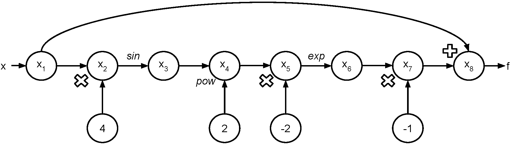

# Milestone 2 Document

## Table of Contents
- [Introduction](#introduction)
- [Background](#background)
- [How to Use adlib](#howtouse)
  - [Examples](#examples)
- [Software Organization](#software_org)
  - [Directory Structure](#structure)
  - [Included Modules](#modules)
  - [Tests](#tests)
  - [Package and Framework](#package)
  - [Distribution](#dist)
- [Implementation](#implementation)
  - [Data Structures](#data_structures)
  - [autodiff](#autodiff)
  - [elem_function](#elem_function)
  - [interact](#interact)
  - [External Dependencies](#dependencies)


## Introduction <a name="introduction"></a>

Automatic differentiation is a method to evaluate derivatives of any linear or nonlinear systems that differs from other traditional methods such as symbolic differentiation or numeric differentiation. Numeric differentiation can be simple to implement but it can also introduce rounding and truncation errors and thus make the results inaccurate. Symbolic differentiation can be time consuming and also result in complex and cryptic expressions. Furthermore, symbolic methods require the model to be close-form which are not applicable in many machine learning problems.

Automatic differentiation addresses the above issues by using chain rules and computing derivatives up to machine precision. It has been well established in many fields including atmospheric sciences, fluid dynamics, optimization, and has been rapidly growing in machine learning.


## Background <a name="background"></a>

As explained in the introduction, automatic differentiation evades both the approximation problems of numeric differentiation and the complexity problems of symbolic differentiation. Essentially, automatic differentiation continuously applies the chain rule to a function at a certain point. Automatic differentiation is able to do this by exploiting the fact that all functions input by a user to a computer can be represented as some combination of elementary functions. These elementary functions include arithmetic functions, trigonometric functions, exponential functions, logarithmic functions, and nth root functions. The function is expanded in terms of these elementary functions, and the chain rule is applied by writing an array of derivatives, each in terms of the last, until a final derivative is found. The implementation of this method is further explained below.

For forward automatic differentiation, first, the function is rewritten as a map of elementary functions applied to the input, with each step in the map being represented by a distinct trace. For example, if the function is “5*x + 1”, some input trace x1 becomes trace x2 by being multiplied by 5, which becomes trace x3 by adding 1, and then x3 is the output. Every elementary function applied to the input is represented by such a change in the trace. This mapping is represented as a flowchart between traces, with elementary functions represented by arrows between traces.

This map is used to generate the elementary function, elementary function value, elementary function derivative, and derivative value for each trace. In the case of multi-value inputs to the function (for example, “5*x +3*y +1”), the partial derivative is taken with respect to each input. For each trace, the elementary function and elementary function derivative are written in terms of the previously-evaluated, constituent traces, and evaluated at the values and derivative values of these constituent traces. In this way, the traces are recursively determined through a continuous application of the chain rule. The evaluated derivative of the final trace becomes the output, and forward automatic differentiation is complete.

For example, if we wanted to compute `f(pi/16)` for `f(x) = x - exp(-2sin(4*x)**2)`, we could use the forward mode to generate the following evaluation trace:

trace | value | derivative
--- | --- | ---
`x1` | `pi/16` | `pi/16`
`x2` | `4*x1` | `pi/4`
`x3` | `sin(x2)` | `sqrt(2)/2`
`x4` | `x3 ** 2` | `1/2`
`x5` | `-2x4` | `-1`
`x6` | `exp(x5)` | `1/e`
`x7` | `-x6` | `-1/e`
`x8` | `x1 + x7` | `pi/16 - 1/e`

And the corresponding evaluation graph would look like the below, where we indicate the input value as `x` and the output value as `f`:



## How to Use adlib <a name="howtouse"></a>

We envision that the end user will install our package in their own terminal using the pip install command.

```
pip install adlib
```

After installing our package as well as the dependencies included in `requirements.txt`, the user can import it into their own program(s) as demonstrated in the following examples.

Alternatively, should the user elect to clone the GitHub repository directly into their own workspace, the user can also run our interact.py file where, via the terminal interface, the user will be prompted to provide a function as input. The function can be a scalar constant, a trigonometric function such as sine, cosine, etc., an exponential, and even vector-valued (more details on supported functions in the implementation section). When inputting functions to interact.py, functions must be written with Python notation for arithmetic and power operations, and using sin(), cos(), tan(), and exp() to signify sine, cosine, tangent, and exponential functions respectively. The following inputs will be the value(s) at which to evaluate the function and its derivative. Note: for this milestone, we are currently only supporting scalar functions.

As mentioned in the sentence above the previous paragraph, if the user is a developer who would want to use our package in his/her code, he/she will need to import it the following way:

```
import adlib
import adlib.elem_function as ef
from adlib.autodiff import AutoDiffToy as ADT
```

The user would be able to create an AutoDiffToy object by calling the constructor with a specific value as the argument, which will be the value at which the function and its derivative will be evaluated.

### Examples <a name="examples"></a>

Simple scalar function
```
x = ADT(3)
my_func = ADT(x**2 + 1)
my_func.val → will produce the output: 10
my_func.der → will produce the output: 6
```

Trigonometric scalar function (`sin x`, `cos x`, `tan x`)
```
x = ADT(0)
my_func = ADT(ef.sin(x))
my_func.val → will produce the output: 0
my_func.der → will produce the output: 1
```

Resetting a function value
```
x = ADT(0)
x.val → will produce the output: 0
x.val = 1
x.val → will produce the output: 1
```

## Software Organization <a name="software_org"></a>

### Directory Structure <a name="structure"></a>
```
cs207-FinalProject/
    adlib/
        __init__.py
        autodiff.py
        interact.py
        elem_function.py
    tests/
         __init__.py
         test_autodiff.py
         test_elem_function.py
         test_interact.py
    docs/
        milestone1.md
        milestone2.md
    setup.py
    requirements.txt
```
### Included Modules <a name="modules"></a>
  - \_\_init\_\_.py

    This module is used for package initialization.

  - autodiff.py

    This module contains our automatic differentiation class, AutoDiffToy, which is meant to be imported by developers and used to instantiate AutoDiffToy objects. The class overloads Python’s arithmetic operators in order to support the construction of more complex AutoDiffToy objects.

  - interact.py

    This module allows the user to interact with the our automatic differentiation library via a command line interface. The user is prompted for a function f(x) to evaluate, then for an x-value to evaluate at. The module prints the final value and derivative of the given function at the given x-value.

  - elem_function.py

    This module is used in conjunction with autodiff.py to support basic elementary functions (e.g., `exp`, `sin`, `cos`, `tan`) in the construction of more complex AutoDiffToy objects. Each of these elementary functions take in an AutoDiffToy object as input and return a new AutoDiffToy object with the appropriate value and derivative (by passing in the input’s value and derivative to the corresponding numpy function). If, instead of an AutoDiffToy object, a float value is passed in, the elementary function will simply pass in the float value to the corresponding numpy function and return that new value instead.

### Tests <a name="tests"></a>
  - Tests are in the tests/ directory.
  - External continuous integration service (TravisCI) is used for testing. CodeCov is used to measure the coverage of testing.
  - Both TravisCI and CodeCov badges are embedded in README.md.

### Package and Framework <a name="package"></a>

  - We’ve added a setup.py module in the root directory and will use ```python setup.py sdist```to package our software, then use ```python setup.py register``` to register our package on PyPI.
  - Frameworks are not needed here since our software packaging is pretty straightforward and does not depend on any external service.

### Distribution <a name="dist"></a>

  The package will be available on PyPI and users can install the package using ```pip install adlib```.

## Implementation <a name="implementation"></a>

### Data Structures <a name="data_structures"></a>

The core data structures used in our final implementation will be classes (e.g., to represent our automatic differentiation objects), lists (e.g., for our trace evaluation steps), and dictionaries (e.g., to support vector-valued inputs after this milestone). At the moment (for this milestone), we’ve mainly used classes and functions.

### autodiff <a name="autodiff"></a>

We’ve written an `autodiff` module that contains the primary Class of this library, AutoDiffToy. The class contains two properties: `val` and `der` (representing the value and the derivative of a function), and several overloaded methods (the basic arithmetic operators, unary and binary). This allows the user to model any function of their pleasing as an AutoDiffToy by constructing its parts from the ground up (not unlike the progression of a forward mode evaluation trace).

The AutoDiffToy takes in a mandatory argument, the value of the function. By default, `val` is 0 because the simplest possible AutoDiffToy would be a single scalar, so we’ve arbitrarily chosen 0 as its default value. On the other hand, AutoDiffToy can also take in an optional argument, the derivative of the function. By default, `der` is 1, since the derivative of any `x` is 1, regardless of its value.

This allows the user to begin the construction of more complex functions by starting with `x = ADT(n)`, where `n` is the numerical value at which they’d eventually like to evaluate their function and its derivative. As one can observe from the code, the overloaded arithmetic operators support arithmetic operations between AutoDiffToy and AutoDiffToy, as well as between AutoDiffToy and float.

As of this milestone, we’ve opted against providing getter and setter methods for this class, since they would be equivalent to accessing and updating `val` and `der` directly. It is the responsibility of the user to do this with care, as updating `val` and/or `der` would, by design, overwrite the current value and/or derivative of their function.

### elem_function <a name="elem_function"></a>

We’ve written an `elem_function` module to be able to support a variety of elementary functions. As of right now, we only support `exp`, `cos`, `sin`, and `tan`, as well as constant values, and any scalar functions composed of the aforementioned supported elementary functions. By the end of this project, we hope to support the following complete list:
- Constant functions (`2`, `pi`, etc)
- Powers of x (`x`, `x**2`, `x**3`, etc)
- Roots of x, (`sqrt(x)`)
- Exponential functions (`exp(x)`)
- Logarithms (`log(x)`)
- Trigonometric functions (`sin(x)`, `cos(x)`, `tan(x)`)
- Inverse trigonometric functions (`arcsin(x)`, `arccos(x)`, `arctan(x)`)
- Hyperbolic functions (`sinh(x)`, `cosh(x)`, `tanh(x)`)
- All functions obtained by adding, subtracting, multiplying, dividing, and composing any of the above functions.

The idea is that the user (in their driver code), first instantiates an AutoDiffToy object (as via `x = ADT(n)`, where `n` is the value at which they’d like to evaluate the function). Then, the user can construct whichever function they’d like by calling any of the elementary functions supported in this module as needed (e.g., `y = ADT(5*x + ef.sin(x))`). If the initial input `x` is defined as a constant (as via `x = n`, where `n` is some floating-point value), the elementary functions supported in this module will simply pass in the scalar `x` into the corresponding `numpy` function and return that value.

### interact <a name="interact"></a>

As described in previous sections, the `interact` module is meant as a toy command line interface for the user, which prompts the user to input a function (formatted as they would write it in Python), as well as a value at which to evaluate the function, and then outputs the function’s value and derivative.

This module uses an external library, `mock`, to execute the user’s string input as if it were code. This, of course, only works as long as the user formats their input string properly. Thus, the `main` function of this program will continue to prompt the user for input until they provide a properly-formatted function string.

### External Dependencies <a name="dependencies"></a>

The `numpy` library supports math operations and elementary functions.
The `pytest` library supports coverage testing.
The `mock` library supports mock-inputs to the keyboard for the user interface (interact.py).
